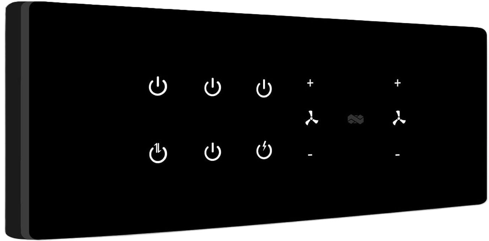

# IoT SwitchBoard for Home Assistant

  



  

ESP8266-based smart switch board with native Home Assistant integration via MQTT, web interface, and OTA updates.

  

## 🔌 Feature Details

### Home Assistant Integration

-  **Automatic MQTT Discovery**: Devices self-register in Home Assistant using MQTT discovery protocol

-  **Bi-directional Communication**: Real-time sync between physical switches and HA dashboard

-  **Status Reporting**: Continuous availability monitoring and board temperature telemetry

  

### Switch Management

-  **Configurable Switches**: Control switch to toggle AC/DC loads via GPIO pins

-  **Logic Inversion Support**: Handles both normally-open and normally-closed relays and Inverse relays.

-  **State Persistence**: Remembers switch states through reboots using EEPROM

  

### Network Features

-  **Dual Mode Operation**:

- Station (STA) Mode: Connects to predefined WiFi network in the code

- Access Point (AP) Mode: Self-contained config portal (SSID: `IoT-Switch-Config`)

-  **Self-Healing**: Automatically reverts to AP mode if WiFi connection drops

  

### Web Interface

-  **Mobile-Optimized Dashboard**: Responsive design works on all screen sizes

-  **OTA Updates**: Firmware upgrades via browser (no USB connection required)

-  **Real-time Control**: Instant switch toggling with visual feedback

-  **Configuration Portal**: Web-based settings management

<br><br>
  
  
  
## 🛠️ Hardware Specifications

| Component | Details |

|------------------------|-------------------------------------------------------------------------|

| **Microcontroller** | ESP8266 NodeMCU v1.0 (CP2102 chip) | Also support other ESP devices like ESP32, ESP-01, ESP Cam etc

| **Relays** | 5V relay module (10A 250VAC/30VDC per channel) |

| **Power Supply** | 5V 2A DC with screw terminal (Barrel jack or micro USB) |

| **GPIO Mapping** | It should be cofigured in the code | It supports switches as per the no of GPIO's avaialble in the specific MCU

| **Indicator LEDs** | Built-in WiFi status (Blue) and Power (Red) |

  

## ⚡ Installation Guide

### 1. Software Requirements

- Arduino IDE 2.x+ with ESP8266 Core

- Required Libraries:

```bash

arduino-cli lib install "PubSubClient@2.8"

arduino-cli lib install "ArduinoJson@6.21"

arduino-cli lib install "ESP8266WiFi"

arduino-cli lib install "ESP8266WebServer"

```

  

### 2. Flashing Firmware

1. Connect NodeMCU via USB

2. Select board type: `NodeMCU 1.0 (ESP-12E Module)`

3. Set Flash Mode: `DIO`

4. Upload Speed: `115200`

5. Flash using:

```arduino

Sketch > Upload

```

  

### 3. Web Interface Deployment

Upload web assets to SPIFFS:

```bash

# Using esptool (replace COM3 with actual port)

python  esptool.py  --port  COM3  write_flash  -fm  dio  0x300000  data/*

```

  

## ⚙️ Configuration Details

Create `data/config.json` with these parameters:

  

```json

{

// Device Identity

"DeviceName": "LivingRoom_Switch",

// WiFi Settings

"wifi_ssid": "YOUR_WIFI_SSID",

"wifi_password": "YOUR_WIFI_PASSWORD",

// MQTT Broker Configuration

"mqttHost": "homeassistant.local",

"mqttPort": 1883,

"mqttUsername": "mqtt_user",

"mqttPassword": "mqtt_pass",

// Switch Configuration Array

"switches": [

{

"name": "main_light", // Unique identifier

"gpioPin": 5, // D1 pin (GPIO5)

"inverseOn": false, // Relay logic inversion

"payload_on": "ON", // MQTT ON payload

"payload_off": "OFF"  // MQTT OFF payload

}

// Add more switch configs as needed

]

}

```

  

## 🏠 Home Assistant Integration

### Automatic Discovery

Devices appear automatically in HA under:

`Configuration > Devices & Services > MQTT`

  

### Manual Configuration

Example switch entity:

```yaml

switch:

- platform: mqtt

name: "Living Room Main Light"

unique_id: "livingroom_main_light"

state_topic: "homeassistant/mydevices/LivingRoom_Switch/main_light/state"

command_topic: "homeassistant/mydevices/LivingRoom_Switch/main_light/command"

payload_on: "ON"

payload_off: "OFF"

qos: 1

retain: true

```

  

## 🌐 Web Interface Guide

Access at `http://[DEVICE_IP]/`

Home Page


Config Page


Switches Page


  

### Key Features:

-  **Real-time Status**: Visual indicators for switch states

-  **Mobile-responsive**: Touch-friendly interface

-  **OTA Updates**: Drag-and-drop firmware updates

-  **Network Configuration**: WiFi credential management

  

### API Endpoints:

| Endpoint | Method | Description |

|----------------|--------|-----------------------------|

| `/switches` | GET | JSON array of switch states |

| `/config` | POST | Update device configuration|

| `/update` | POST | Upload new firmware |

| `/reboot` | POST | Restart device |

  

## 🔧 Advanced Troubleshooting

| Symptom | Solution | Verification Method |

|---------------------------|-----------------------------------|------------------------------------|

| **AP Mode persistent** | Verify WiFi credentials | Check serial logs for auth errors |

| **MQTT disconnections** | Ensure broker supports MQTT 3.1.1 | Test with mosquitto_sub |

| **OTA failures** | Validate SPIFFS partition size | Check Arduino IDE partition scheme|

| **Switch state mismatch** | Confirm GPIO mapping | Test with multimeter continuity |

| **Web interface not loading** | Verify SPIFFS file upload | Check `/` endpoint via cURL |

  

## 📄 License

MIT License - Full text available in [LICENSE](LICENSE)